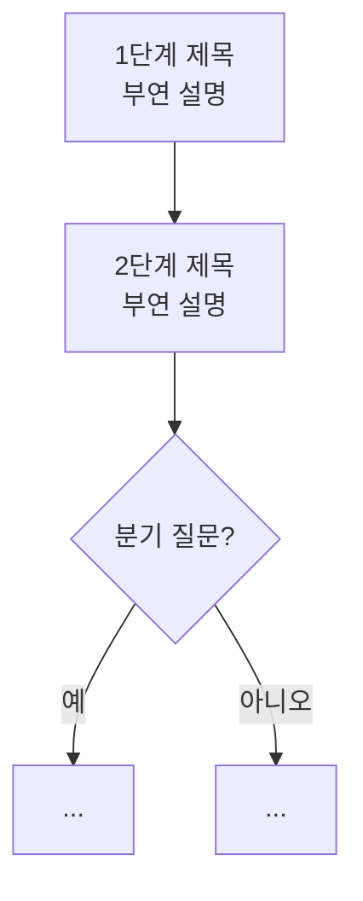

# PROMPT_ENHANCE — 시각요소 보강 규칙 (재사용 템플릿)

> 사용법: 이 파일을 클로드 코드에게 그대로 보여주면서
> **"priority 1~N번 규칙대로 `content/posts/{slug}.md` 시각요소 보강해줘"** 라고 지시한다.
> 이미 `PROMPT_GENERATE.md`로 만든 글에 **요약 박스·표·흐름도**를 입히는 2단계 작업이다.

---

## 입력 변수

| 변수 | 의미 |
| --- | --- |
| `{slug}` | 보강할 글의 슬러그 (`content/posts/{slug}.md`) |
| `{notes}` | 이 글에만 적용할 강조점/흐름도로 표현할 핵심 단계 |

---

## Priority 1 — 서론 직후 "핵심 요약" 박스

- 두괄식 서론 바로 다음에 **인용블록 요약 박스**를 넣는다. 핵심 3개 항목, 키워드는 굵게.

```markdown
> **핵심 요약**
> - 첫째 핵심 (키워드 **굵게**)
> - 둘째 핵심
> - 셋째 핵심
```

## Priority 2 — 표 보강

- 본문에 비교·분류·요약이 들어갈 자리에 **표를 최소 1개** 둔다(없으면 추가).
- 표 아래에는 필요 시 "표는 큰 구조만 보여주는 예시" 같은 **한계 안내**를 인용블록으로 덧붙인다.

## Priority 3 — 흐름도가 필요한 자리에 "자리표시자 + alt + 캡션" 삽입

- 순서/단계/분기가 있는 설명 옆에 흐름도를 넣는다. 먼저 **자리표시자 형태**로 마크다운에 자리를 잡는다.

```markdown

*{이미지 아래 캡션: 흐름도가 말하는 한 줄 요약}*
```

- **alt 텍스트**는 화면을 못 보는 사람도 흐름을 알 수 있게 단계를 풀어 쓴다.
- **캡션**(`*...*`)은 이미지 바로 아래 한 줄.
- 이미지 경로는 항상 `/images/{slug}-flow.png` (Hugo `static/images/`로 배포됨).

## Priority 4 — 자리표시자를 Mermaid 다이어그램으로 변환

### 4-1. Mermaid 소스 작성
- `diagrams/{slug}-flow.mmd`에 흐름도를 작성한다.
- `flowchart TD`(세로) 기본. 노드 라벨은 `["제목<br/>설명 한 줄"]` 형태(제목 + `<br/>` + 부연).
- 분기·선택은 결정 노드 `{"질문?"}` + 분기 라벨 `-->|값|`로 표현.



### 4-2. PNG로 변환 (공유 테마 적용)
- 모든 흐름도는 **공유 테마 파일**을 함께 적용해 6개든 N개든 **동일한 스타일**을 갖는다.
  - `diagrams/mermaid-config.json` (색상·글자크기·레이아웃)
  - `diagrams/mermaid-theme.css` (둥근 모서리·선 두께)
- 변환 명령(로컬 `mmdc`, `@mermaid-js/mermaid-cli`):

```bash
./node_modules/.bin/mmdc \
  -i diagrams/{slug}-flow.mmd \
  -o static/images/{slug}-flow.png \
  -c diagrams/mermaid-config.json \
  -C diagrams/mermaid-theme.css \
  -b transparent
```

- **scale 미지정(=1)**: 산출 PNG의 픽셀 크기 = 레이아웃 크기. CSS 상한선(600px)이 의도대로 작동.
- **width/height 미지정 + `useMaxWidth:false`**: 이미지 크기를 강제하지 않는다.

## Priority 5 — 확정 스타일 테마 (그대로 유지)

핵심 원칙: **"이미지 크기를 먼저 정하고 글자를 맞추는" 게 아니라, "글자 크기(28px)를 고정하고 이미지가 내용에 맞게 커지거나 작아지게" 한다.**

### `diagrams/mermaid-config.json`
```json
{
  "theme": "base",
  "themeVariables": {
    "fontFamily": "-apple-system, 'Segoe UI', 'Apple SD Gothic Neo', 'Malgun Gothic', sans-serif",
    "fontSize": "28px",
    "primaryColor": "#EDE8E0",
    "primaryBorderColor": "#C7BEB0",
    "primaryTextColor": "#2D2A26",
    "lineColor": "#8C8782",
    "secondaryColor": "#E4E7E9",
    "secondaryBorderColor": "#C7BEB0",
    "secondaryTextColor": "#2D2A26",
    "tertiaryColor": "#F4F1EC",
    "tertiaryBorderColor": "#C7BEB0",
    "tertiaryTextColor": "#2D2A26",
    "edgeLabelBackground": "#F4F1EC"
  },
  "flowchart": {
    "curve": "basis",
    "padding": 16,
    "nodeSpacing": 45,
    "rankSpacing": 55,
    "wrappingWidth": 520,
    "useMaxWidth": false
  }
}
```

- **글자 크기**: `fontSize: 28px` 고정(모든 흐름도 공통).
- **색상 톤**(블로그 톤에 맞춘 차분한 베이지/그레이):
  - 노드 배경 `#EDE8E0`(연한 베이지) · 테두리 `#C7BEB0`
  - 텍스트 `#2D2A26`(짙은 색) · 화살표 `#8C8782`(중간 톤 회색)
  - 엣지 라벨 배경 `#F4F1EC`
- `wrappingWidth: 520`: 한국어 `<br/>` 줄이 또 쪼개지지 않도록 줄바꿈 폭 확보.

### `diagrams/mermaid-theme.css`
```css
/* 사각형 노드 모서리를 둥글게 (마름모=결정 노드는 그대로) */
.node rect {
  rx: 10px;
  ry: 10px;
}
.node rect,
.node polygon {
  stroke-width: 1.5px;
}
.edgePath .path {
  stroke-width: 1.5px;
}
```

## Priority 6 — 사이트 CSS 처리 방식 (`assets/css/extended/custom.css`)

- 흐름도 이미지는 **원본 비율을 유지하며 본문 폭·절대 상한선(600px)을 넘지 않게** 한다.
- `max-width`를 작은 고정값(예전 280px)으로 **강제로 누르지 않는다**. 개별 예외 규칙(예: 특정 글용 420px)도 두지 않는다.

```css
/* 흐름도 이미지: 원본 비율·크기 유지, 본문 폭과 상한선(600px) 내에서 자동 표시 */
.post-content img[src*="-flow"] {
  width: auto;
  max-width: min(100%, 600px);
  height: auto;
  margin: 1.5em auto;
}
```

- `width: auto` + `max-width: min(100%, 600px)`:
  - 작은 흐름도(예 462px)는 **원본 크기 그대로** 작게,
  - 큰 흐름도(600px 초과)는 **600px에서 캡**, 비율 유지.
- 일반 본문 이미지 기본 규칙은 그대로 둔다:
  ```css
  .post-content img { max-width: 100%; height: auto; display: block; margin: 1.5em auto; }
  ```

---

## 산출물 체크리스트(보강 후 자가 점검)

- [ ] 서론 직후 "핵심 요약" 박스(3항목, 키워드 굵게)
- [ ] 표 최소 1개(+ 필요 시 한계 안내)
- [ ] 흐름도 자리: 마크다운 `` + 캡션
- [ ] `diagrams/{slug}-flow.mmd` 작성
- [ ] 공유 테마(config + css)로 `static/images/{slug}-flow.png` 변환
- [ ] 글자 28px 고정 · 이미지 크기는 내용 따라 변동(width/height 미강제, scale 1)
- [ ] 색상·둥근 모서리 테마 일관 적용
- [ ] `custom.css` 흐름도 규칙 = `min(100%, 600px)`, 강제 축소·예외 규칙 없음
